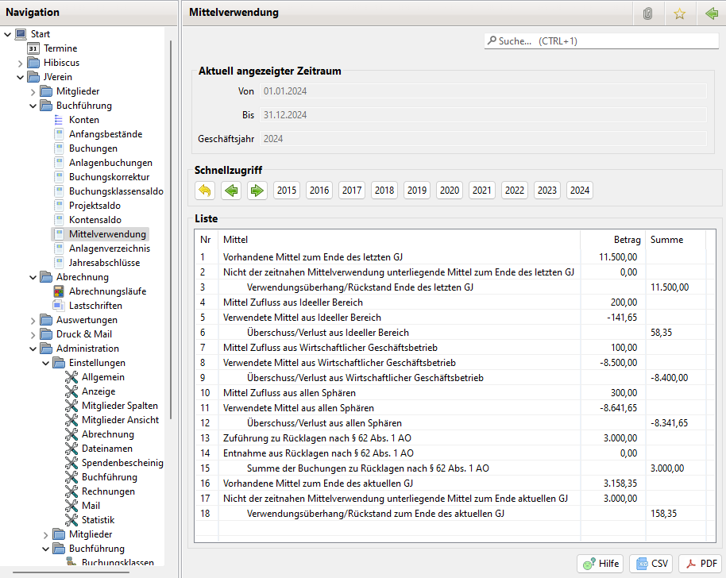

# Mittelverwendung

### Aktivierung

Zur Nutzung der Mittelverwendung ist die Option in Administration->Einstellungen->Anzeige zu aktivieren.

Anschließend sollte JVerein neu gestartet werden, damit der Menüpunkt "Mittelverwendung" zur Verfügung steht.

### Allgemeines

Gemeinnützige Vereine müssen ihre Einnahmen (Finanzen und Sachen) im aktuellen und den zwei folgenden Jahren verwenden muss (zeitnahe Verwendung). Dieses müssen sie dem Finanzamt nachweisen. Sie dürfen aber Rücklagen und Vermögen bilden. Diese sind der zeitnahen Verwendung entzogen.

Es gibt keine feste Vorgabe wie ein Mittelverwendung Nachweis auszuschauen hat. JVerein zeigt einen Report der den Mittel Zufluss und Abfluss und die zeitnah zu verwendenden Mittel bzw. verwendeten Mittel eines Jahres zeigt.

Aus dem Report kann man z.B. sehen ob die zu verwendenden Mittel (abzüglich Entnahmen aus Rücklagen) des Geschäftsjahres kleiner sind als die im Geschäftsjahr verwendeten Mittel. Falls ja wurde alles in diesem Jahr ausgegeben und die zeitnahe Mittelverwendung wäre erfüllt. Wird nicht alles ausgegeben muss es im folge Jahr passieren.

### Anzeige

Der Mittelverwendung Report lässt sich über den entsprechenden Menüeintrag in der Navigation öffnen.

Der Report listet folgende Informationen auf:
* Verwendungsrückstand/-überhang am Ende des letzten Geschäftsjahres: Dies ist der Bestand der Geldkonten und zweckfremden Anlagenkonten abzüglich des Bestandes der Rücklagen und des Vermögens
* Insgesamt im Geschäftsjahr zugeflossene Mittel
* Zu verwendende Mittel. Dies ist die Summe der beiden vorhergehenden Posten. Diese Summe muss im aktuellen und folgenden Geschäftsjahr ausgegeben werden
* Im Geschäftsjahr zugeflossene Mittel
* Zugeführte Rücklagen (nach Rücklagenart getrennt) als Mittelabfluss
* Entnommene Rücklagen (nach Rücklagenart getrennt) als Mittelzufluss
* Verwendungsrückstand/-überhang zum aktuellen Zeitpunkt. Für das Finanzamt ist dieser Report zum Ende des aktuellen Geschäftsjahres zu erstellen

PS: Die Endsummen werden aus den getätigten Buchungen berechnet. Sie sollten mit den Anfangsbeständen der Konten des nächsten Geschäftsjahres überein stimmen. Ist das nicht der Fall, dann sind einige Buchungen nicht richtig verbucht worden z.B. wegen fehlender Buchungsart.

Ist in Administration->Einstellungen->Buchführung die Checkbox "Listen: Buchungsarten ohne Buchung unterdrücken" ausgewählt werden Rücklagenarten ohne Buchungen im Report nicht angezeigt.

Die Zeilen in der Mittelverwendung sind nummeriert damit man bei einem evtl. Begleitschreiben an das Finanzamt auf die Zeilen Bezug nehmen kann.

Der Report kann über die Buttons CSV und PDF ausgegeben werden.

### Annahmen

Für eine korrekte Berechnung der Daten des Reports sind folgende Annahmen getroffen:
* Alle Konten auf denen vorhandene Mittel (Geld) verwaltet ist, ist die Kontoart Geldkonto zugewiesen
* Konten für Schulden wie z.B. Darlehen, Kredite etc. sind als Verbindlichkeitskonto gekennzeichnet
* Anlagenkonten ist der korrekte Anlagenzweck zugeordnet (entweder als nutzungsgebundene Anlage oder zweckfremde Anlage)
* Rücklagen sind auf Rücklagenkonten verbucht
* Buchungen muss die korrekte Buchungsart mit korrekter Klassifikation als Einnahme, Ausgabe oder Umbuchung zugewiesen sein

Einnahmen und Ausgaben werden wie folgt berechnet:
* Zu den Einnahmen zählen alle Buchungen der Art Einnahme die auf Geldkonten oder allen Anlagenkonten (Sachspenden) eingehen
* Zu den Ausgaben zählen alle Buchungen der Art Ausgabe die von Geldkonten oder zweckfremden Anlagen abgehen
* Umbuchungen innerhalb Geldkonten, innerhalb zweckfremden Anlagen und zwischen beiden gelten als Umschichtung und sind damit keine Mittelzuflüsse und Abflüsse
* Umbuchungen zu Verbindlichkeitskonten (Darlehensauszahlung, Tilgung) und nutzungsgebundenen Anlagenkonten (Anschaffung einer Anlage) werden berücksichtigt. Dazu werden positive Umbuchungen auf diesen Konten als Mittelabfluss und negative Umbuchungen als Mittelzufluss betrachtet. Es wird davon ausgegangen, dass alle Umbuchungen auf diesen Konten von Geldkonten kommen
* Es darf also keine Umbuchungen innerhalb Verbindlichkeitskonten und nutzungsgebundenen Anlagenkonten geben

Hinweise:

Bei einem Abrechnungslauf werden bei Lastschriften einzelne Buchungen generiert und eine Gegenbuchung. Später wird der Betrag der Gegenbuchung per Lastschrift eingezogen.

Es ist darauf zu achten, dass die Gegenbuchung die Buchungsart Einnahme hat. Hätte sie die Art Ausgabe, wären die Angaben zu den Ausgaben im Report falsch. Dann wären auch die Einnahmen doppelt, wegen der Buchungen und eingegangenen Lastschrift. Die Summe würde zwar stimmen aber nicht die Angaben zu den Einnahmen und Ausgaben.

## Buchungsbeispiele

### Aufnahme von Darlehen, Kredite etc.

Die Aufnahme eines Darlehens oder Kredit wird als Mittelzufluss betrachtet. Diese Gelder unterliegen der zeitnahen Mittelverwendung. Sie sind wie folgt zu buchen:
* Auf dem Geldkonto (Kontoart Geldkonto) wird die Darlehenssumme (positiv) mit einer Buchungsart "Umbuchung" gebucht
* Auf dem Darlehenskonto (Kontoart Verbindlichkeitskonto) wird die Darlehenssumme (negativ) mit einer Buchungsart "Umbuchung" gebucht

### Tilgung von Darlehen, Kredite etc.

Die Tilgung eines Darlehens oder Kredit wird als Mittelabfluss betrachtet. Sie sind wie folgt zu buchen:
* Auf dem Geldkonto (Kontoart Geldkonto) wird der Tilgungsbetrag (negativ) mit einer Buchungsart "Umbuchung" gebucht
* Auf dem Darlehenskonto (Kontoart Verbindlichkeitskonto) wird der Tilgungsbetrag (positiv) mit einer Buchungsart "Umbuchung" gebucht

### Ein Mitglied spendet ein gegebenes Darlehen oder Kredit

Die Spende wird mit einer Buchungsart "Einnahme" auf dem Darlehenskonto verbucht.

Im Buchungsklassensaldo taucht diese Summe als Einnahme auf. In der Mittelverwendungsrechnung taucht dieser Betrag nicht auf. Es fliesen ja aktuell keine Mittel zu. Die Mittel sind ja schon bei Aufnahme des Darlehens zugeflossen. Lediglich der Mittelabfluss durch Tilgung entfällt zukünftig.

### Anschaffung einer nutzungsgebundenen Anlage

Anschaffungen die dem Zweck des Vereins dienen, also Anschaffungen im Ideellen Bereich oder im Zweckbetrieb werden als Mittelabfluss bewertet. Es handelt sich hier also um eine Mittelverwendung. Die Buchung erfolgt so:
* Es wird ein Anlagenkonto mit dem Anlagenzweck "Nutzungsgebundene Anlage" angelegt
* Die Anschaffungskosten werden auf dem Geldkonto abgebucht (negativ) mit einer Buchungsart "Umbuchung"
* Die Anschaffungskosten werden auf dem Anlagenkonto eingebucht (positiv) mit einer Buchungsart "Umbuchung"

### Verkauf einer nutzungsgebundenen Anlage

Bei Verkauf einer nutzungsgebunden Anlage fliest der gesamte Verkaufspreis einem Geldkonto zu. Dieser gesamte Betrag unterliegt jetzt wieder der zeitnahen Mittelverwendung. Die Buchung erfolgt so:
* Auf dem Geldkonto wird der Verkaufspreis verbucht mit einer Buchungsart "Einnahme"
* Auf dem Anlagenkonto wird der aktuelle Buchwert der Anlage ausgebucht mit einer Buchungsart "Ausgabe"

### Abschreibungen bei einer nutzungsgebundenen Anlage

Abschreibungen werden auf dem Anlagenkonto als Ausgabe gebucht. Sie fliesen nicht in die Mittelverwendungsrechnung ein weil Anlagen hier mit dem Buchwert verrechnet werden.

### Anschaffung einer zweckfremden Anlage

Anschaffungen die nicht dem Zweck des Vereins dienen aber zur Mittelbeschaffung dienen, also Anschaffungen in der Vermögensverwaltung oder im wirtschaftlichen Geschäftsbetrieb, werden nicht als Mittelabfluss bewertet. Diese unterliegen also der zeitnahen Mittelverwendung. Diese Konten werden also wie Geldkonten behandelt. 

Diese Anlagen dürfen nur aus vorhandenen freien Rücklagen oder aus dem Vermögen finanziert werden. Es müssen also freie Rücklagen oder Vermögen in dieser Höhe vorhanden sein. Die Buchung erfolgt so:
* Es wird ein Anlagenkonto mit dem Anlagenzweck "Zweckfremde Anlage" angelegt
* Die Anschaffungskosten werden auf dem Geldkonto abgebucht (negativ) mit einer Buchungsart "Umbuchung"
* Die Anschaffungskosten werden auf dem Anlagenkonto eingebucht (positiv) mit einer Buchungsart "Umbuchung"

### Verkauf einer zweckfremden Anlage

Bei Verkauf einer zweckgebundene Anlage fliest der gesamte Verkaufspreis einem Geldkonto zu. Der Gewinn aus dem Verkauf wird als Gewinn aus Umschichtungen bezeichnet. Da dieser Gewinn aus freien Rücklagen oder Vermögen finanziert wurde, kann dieser den freien Rücklagen oder dem Vermögen zugeführt werden, je nachdem aus welchen der beiden Mittel er gekauft wurde. Die Buchung erfolgt so:
* Auf dem Geldkonto wird der Verkaufspreis verbucht mit einer Buchungsart "Einnahme"
* Auf dem Anlagenkonto wird der aktuelle Buchwert der Anlage ausgebucht mit einer Buchungsart "Ausgabe"
* Der Gewinn wird im Konto der freien Rücklage oder dem Vermögen als Zuführung (Einnahme) verbucht

### Abschreibungen bei einer zweckfremden Anlage

Anscheinend ist es nicht klar geregelt wie Abschreibungen bei zweckfremden Anlagen behandelt werden sollen. In der Buchführung werden sie als Ausgabe gebucht wie bei nutzungsgebndenen Anlagen, da auch diese Anlagen mit dem Buchwert geführt werden.

Es gibt jetzt wohl zwei Ansätze:

Weg 1:
* Da die Anlage aus freier Rücklage oder Vermögen finanziert wurde reduziert sich das Vermögen. Darum reduziert man auch die freie Rücklage bzw. das Vermögen durch eine gleich hohe Ausgabenbuchung
* Bei Verkauf kann man dann vermutlich die Differenz aus Buchwert und Verkaufserlös wieder gutschreiben

Weg 2:
* Die freie Rücklage oder das Vermögen wird nicht reduziert
* Bei Verkauf kann man dann vermutlich dann nur die Differenz aus Anschaffungskosten und Verkaufserlös wieder gutschreiben

Der Weg 2 führt zu einem Mittelverwendungsüberhang weil die vorhandenen Mittel reduziert wurden aber nicht die Rücklagen bzw. das Vermögen.

### Geldspenden

Geldspenden sind Mittelzufluss und unterliegen damit grundsätzlich der zeitnahen Mittelverwendung. Ein Spender sollte davon ausgehen können, dass die Spende auch zeitnah verwendet wird.

§ 62 Abs. 3  AO definiert aber Ausnahmen. Erfolgt die Spende aus einem der genannten Gründe, dann kann diese Spende in das Vermögen überführt werden. Es wird wie folgt gebucht:
* Auf dem Geldkonto wird die Spende verbucht mit einer Buchungsart "Einnahme"
* Die Spende wird zusätzlich auf einem Konto der Kontoart "Vermögen nach § 62 Abs. 3 und 4 AO" als Einnahme verbucht
* Sollte noch kein Konto der Kontoart "Vermögen nach § 62 Abs. 3 und 4 AO"  existieren, dann muss es neu angelegt werden

### Sachspende

Eine Sachspende gilt nicht als Mittelzufluss sondern ist grundsätzlich eine Zuführung zum Vermögen (§ 62 Abs. 4 AO). Es wird wie folgt gebucht:
* Es wird ein Anlagenkonto für die gespendete Sache angelegt und der Wert der Anlage als Buchung mit einer Buchungsart "Einnahme" verbucht
* Die Spende wird zusätzlich auf einem Konto der Kontoart "Vermögen nach § 62 Abs. 3 und 4 AO" als Einnahme verbucht
* Sollte noch kein Konto der Kontoart "Vermögen nach § 62 Abs. 3 und 4 AO"  existieren, dann muss es neu angelegt werden

