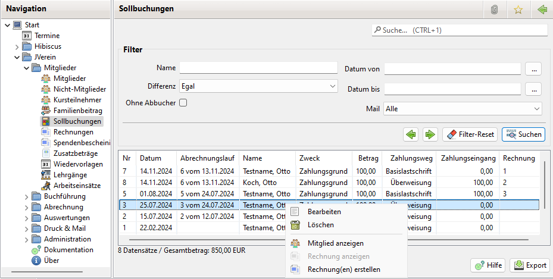
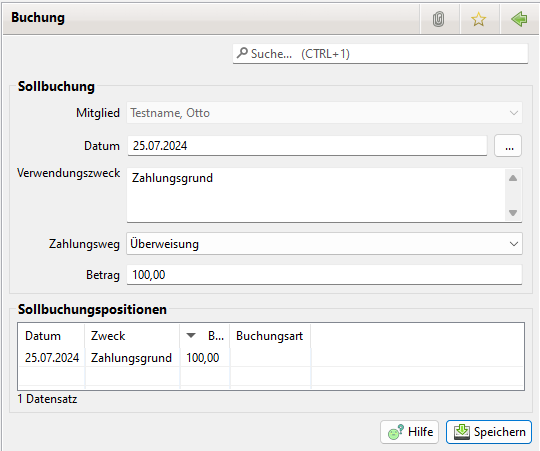

# Sollbuchungen

### Aktivierung

Zur Nutzung der Sollbuchungen ist keine extra Aktivierung notwendig.

### Allgemeines

Sollbuchungen d.h. Beiträge, Zusatzbeträge etc. dienen dazu den Kontostand von Mitgliedern zu führen. Durch die Zuweisung von Istbuchungen kann der Kontostand ausgeglichen werden. 

Die [Abrechnung](../abrech/abrechnung.md) schreibt Sollbuchungen zu Mitgliedsbeiträgen und Zusatzbeträge in die Tabelle [Mitgliedskonto](content/mitgliedskonto.md) des Mitglieds.

### Erstellung 

Die Zusatzbeträge können erstellt werden
* über einen Abrechnungslauf (siehe [Abrechnung](../abrech/abrechnung.md) )
* in den Mitglied Details (siehe [Mitgliedskonto](content/mitgliedskonto.md)) 
* aber auch in der Liste der Sollbuchungen

## Liste der Sollbuchungen 

Es gibt eine zentrale Übersicht über alle Sollbuchungen. Die Sollbuchungen können über einen Zeitraum oder über einen Namen, bzw. Namensfragment gefiltert werden. Zusätzlich kann angegeben werden, ob nur Sollbuchungen mit Differenzen zwischen Soll und Ist \(Offene Posten oder Überzahlungen\) angezeigt werden.

Zudem lässt sich filtern ob das Mitglied per Lastschrift zahlt oder eine Mail Adresse hat. Letzteres ist interessant wenn die Rechnungen bzw. Mahnungen per Mail versendet werden sollen.

Durch einen Doppelklick auf die Sollbuchung wird die Sollbuchung angezeigt.

Folgende Buttons stehen zu Verfügung:
* Exportieren: Damit können die Sollbuchungen als CSV Datei exportiert werden
* Neu: Damit kann eine neue Sollbuchung eingerichtet werden

Durch einen Rechtsklick auf einen Abrechnungslauf öffnet sich ein Kontextmenü mit mehreren Optionen:
* Sollbuchung bearbeiten: Bearbeiten der Sollbuchung
* Sollbuchung löschen: Löschen der Sollbuchungen
* Mitglied anzeigen: Öffnet das Mitglied zur Sollbuchung
* Rechnung anzeigen: Zeigt die zur Sollbuchung gehörige Rechnung an
* Rechnung(en) erstellen: Erstellt Rechnungen für die selektierten Sollbuchungen

## Sollbuchung

Mit einem Klick auf Neu oder Bearbeiten öffnet sich folgender Dialog:

