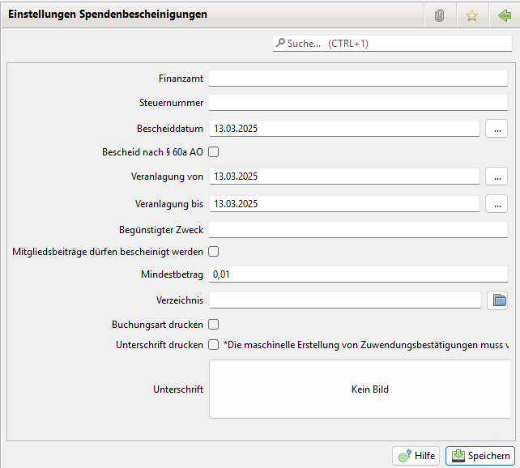

# Spendenbescheinigungen

Hier können die Werte zur Erstellung von Spendenbescheinigungen eingestellt werden.

Neben den steuerlich relevanten Informationen können folgende Daten konfiguriert werden.

#### Mindestbetrag für Spendenbescheinigungen

Allgemeine Einstellung ab welchem Betrag eine Spendenbescheinigung erstellt werden soll. Diese Einstellung kommt bei der automatischen Generierung von Spendenbescheinigungen zum Tragen.

Der Betrag muss größer oder gleich 1ct sein. Ein Betrag von 0€ ist für Spendenbescheinigungen nicht erlaubt.

#### Verzeichnis für Spendenbescheinigungen

Um ein flüssiges Erzeugen von mehreren Dokumenten zu ermöglichen, kann hier das Verzeichnis für die PDF-Dateien festgelegt werden. Wenn aus der Liste der Spendenbescheinigungen heraus die Dokumente generiert werden, werden sie in diese Verzeichnis geschrieben. Das Verzeichnis wird auch vorbelegt, wenn eine Dokumentenerstellung aus der Detailansicht Spendenbescheinigung erfolgt. Hier wird jedoch der Dateidialog angeboten.

#### Buchungsart drucken

Ist das Häkchen gesetzt, wird in der Buchungsliste nicht der Zweck aus der Buchung, sondern die der Buchung zugewiesene Buchungsart verwendet. Bei sprechenden Namen eine einheitlichere Darstellung.

#### Unterschrift drucken

Ist das Häkchen gesetzt, wird beim Standard Druck eine Unterschrift in die Spendenbescheinigung eingefügt.

PS: Ab JVerein 2.9.0 lässt sich auch in individuellen Formularen für Spendenbescheinigungen die hier konfigurierte Unterschrift über ein entsprechendes Formularfeld platzieren.

#### Unterschrift

Hier lässt sich ein Bild der Unterschrift einfügen welche entsprechend der selektierten Option eingefügt wird.
