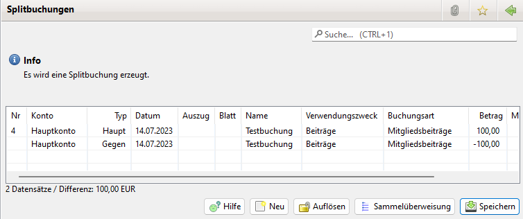

# Splitbuchungen

## Allgemeines

Wofür werden Splitbuchungen gebraucht?

Beispiele:

* Ein Mitglied überweist für mehrere Familienmitglieder den Beitrag in einer Summe. Die Buchung muss für jedes Familienmitglied aufgesplittet werden, damit die Gutschrift für das jeweilige Mitgliedskonto erfolgen kann.
* Der Kassierer überweist einen Gesamtbetrag, der aus buchungstechnischen Gründen auf verschiedene Buchungsarten verteilt werden soll.
* Der Kassierer erzeugt Sammelüberweisungen, deren Einzelposten er auf verschiedene Buchungsarten verteilen muss.

## Splitbuchung erzeugen

Rechtsklick auf die Buchung(en), dann Splitbuchung auswählen:

Es können auch mehrere Buchungen gleichzeitig ausgewählt werden. Sie müssen allerdings den gleichen Betrag haben. Anschließend wird ein Buchungseintrag bearbeitet. Beim Speichern wird eine analoge Aufteilung der Beträge auch auf alle anderen selektierten Buchungen angewendet. 

Sind mehrere Buchungen selektiert, wird der Verwendungszweck und der Kommentar aus der jeweiligen Hauptbuchung kopiert. Wurden diese Daten bei einem der Splitpositionen abgeändert, dann wird der abgeänderte Text in alle Buchungen entsprechend für die jeweilige Splitposition übernommen.

Es erscheint dann:

Als Info wird angezeigt wie viele Buchungen selektiert wurden und damit wie viele Splitbuchungen erzeugt werden.

Die angeklickte Buchung erscheint in der ersten Zeile. In der zweiten Zeile erscheint die Gegenbuchung mit umgekehrtem Vorzeichen beim Betrag.

Jetzt können über den "Neu"-Knopf die Splitbuchungen eingegeben werden:

Das Betrag Feld wird automatisch mit dem noch übrigen Betrag gefüllt.

Mit Speichern wird der Split Eintrag gespeichert und zur Splitbuchung Anzeige zurück gekehrt.

Mit Speichern und nächste kann man direkt zur Eingabe des nächsten Split Eintrags weiter gehen. Wieder wird der noch zu buchende Betrag per Default eingetragen.

Bei der letzten Buchung kann man mit Speichern zur Splitbuchung Anzeige zurück kehren. Bei Speichern und nächste kommt man bei einem Restbetrag von 0€ automatisch zurück.

Das obige Bild zeigt den Stand, dass noch nicht alle Split Einträge erzeugt wurden.

Die Splitbuchungen können nur gespeichert werden, wenn

* Haupt- und Gegenbuchung den gleichen Betrag haben, unabhängig vom Vorzeichen.
* Die Summe der Splitbuchungen muss identisch mit dem Betrag der Hauptbuchung übereinstimmen.
* Die Buchungsart bei der Haupt- und der Gegenbuchung muss identisch sein.
* Jede Buchung muss eine Buchungsart haben.

Sind alle Bedingungen erfüllt (siehe Bild unten) muss die Splitbuchung über den Button Speichern gespeichert werden.

Achtung: Das Speichern bitte nicht vergessen!

## Anzeige der Buchungen

Die Splitbuchungen werden in der Liste der Buchungen "normal" angezeigt. Ein Doppelklick auf eine Haupt-, Gegen- oder Splitbuchung öffnet den Splitbuchungsdialog.

## Sammelüberweisung

Mit einem Klick auf Sammelüberweisung erscheint folgendes Fenster:

Es werden die in Hibiscus vorhandenen Sammelüberweisungen angezeigt. Mit einem Doppelklick auf eine Sammelüberweisung werden die Einzelposten der Sammelüberweisung in die Splitbuchungen übernommen.

## Splitbuchungen auflösen

Sollte versehentlich eine Splitbuchung erzeugt worden sein, kann sie über den Knopf "Auflösen" wieder aufgelöst werden. Die Gegen- und Splitbuchungen werden gelöscht. Bei der Hauptbuchung wird das Splitbuchung Merkmal entfernt.

