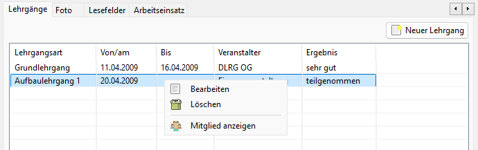

# Lehrgänge
Zur Nutzung der Lehrgänge ist die Option in den Einstellungen->Administration->Einstellungen zu aktivieren.

Anschließend sollte JVerein neu gestartet werden, damit der Tab "Lehrgänge" zur Verfügung steht.

Zur Nutzung sind die [Lehrgangsarten](../../administration/mitglieder/lehrgange.md) in der Administration&gt;Lehrgangsarten einzurichten.

## Lehrgänge Liste beim Mitglied

Mit dem Button Neu kann ein neuer Lehrgang eingerichtet werden.

Durch einen Doppelklick wird die Bearbeitung eines Lehrgangs eingeleitet.

Das Kontextmenü bietet folgende Optionen:
* Bearbeiten: Der ausgewählte Eintrag wird zum Bearbeiten geöffnet
* Löschen: Damit kann ein Lehrgang gelöscht werden
* Mitglied anzeigen: Damit können die Daten des Mitglieds angezeigt werden

## Lehrgang beim Mitglied anlegen

Durch Auswahl des Buttons "Neuer Lehrgang" kann ein neuer Lehrgang für das Mitglied angelegt werden.

Weitere Informationen dazu: [Lehrgänge](../lehrgange.md)
