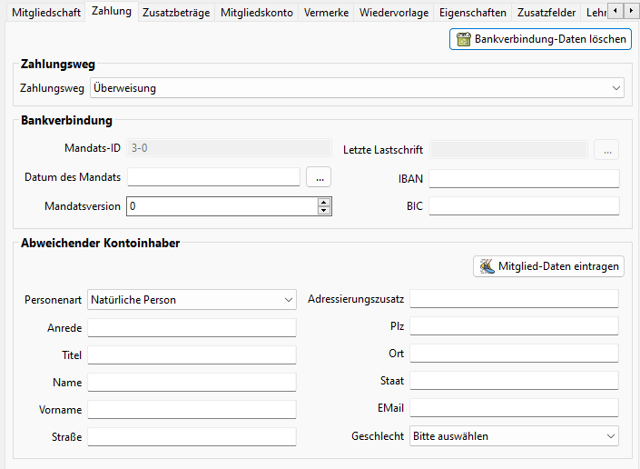

# Zahlung

Als Zahlungswege stehen

* Basislastschrift
* Barzahlung
* Überweisung
* Durch Vollzahlern (nur bei einer Beitragsgruppe vom Typ Familienangehöriger)

zur Verfügung. Die Standardwerte können unter Administration->Einstellungen->Beiträge festgelegt werden.

Beim Zahlungsweg Basislastschrift sind IBAN und Datum des Mandats anzugeben. Durch die Eingabe einer BLZ gefolgt von einem Leerzeichen und der anschließenden Kontonummer wird der SEPA-Konverter angestoßen und die IBAN und die BIC ermittelt.

Die Mandats-ID wird automatisch aus der Mitgliedsnummer oder optional aus der externen Mitgliedsnummer (siehe Einstellungen) gebildet. Zusätzlich wird ein Versionszähler geführt, der das 1., 2., 3. .... Mandat referenziert.

Zusätzlich kann ein abweichender Kontoinhaber angegeben werden falls das Mitglied nicht Kontoinhaber ist.

Ist "Durch Vollzahlern" ausgewählt, wird der Beitrag vom Vollzahler aus dem Familienverband bezahlt. Hier ist kein abweichender Kontoinhaber zu konfigurieren da die Daten aus der Konfiguration der Vollzahlers benutzt werden.

Mit dem Button "Mitglied-Daten übernehmen" werden einige der Daten des Mitglieds übertragen. Hinweis: Es werden nicht alle Daten übertragen, da es sich um einen abweichenden Kontoinhaber handelt. Z. B. der Vorname wird nicht übertragen.

Mit dem Button "Bankverbindung-Daten löschen" werden IBAN, BIC und die Daten in abweichender Kontoinhaber gelöscht.
