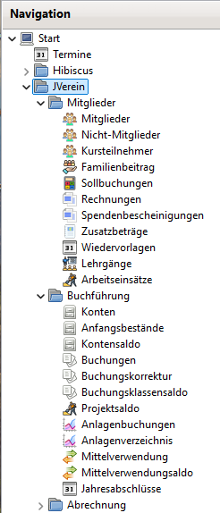

# Navigation

Das Navigationsmenü kann je nach aktivierten Programmfunktionen mehr oder weniger Einträge enthalten. Beispielsweise können Lehrgänge oder Arbeitseinsätze ausgeschaltet werden. In diesem Fall stehen die zugehörigen Programmfunktionen nicht zur Verfügung.

Beispiel für die Navigation:

  
